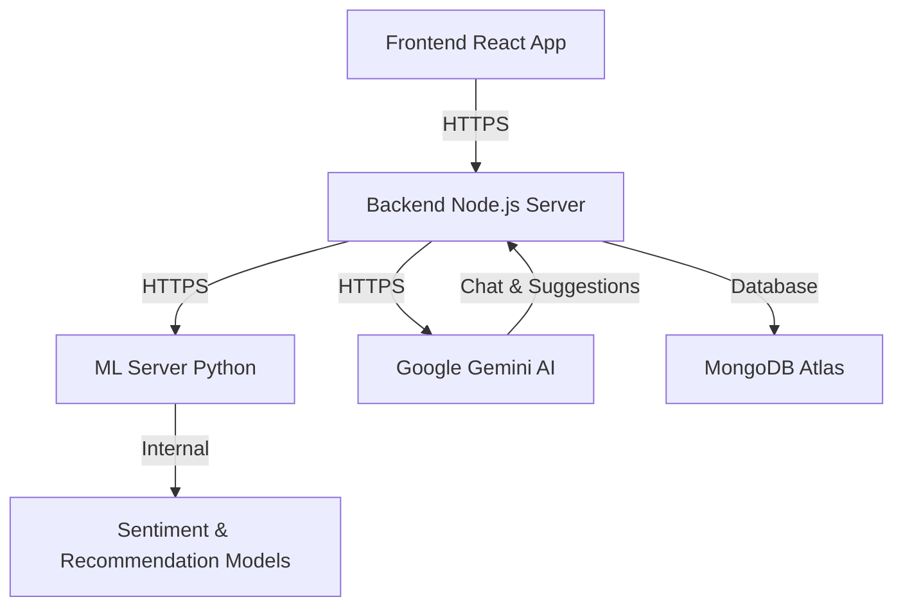

# MindEase - Full Project Documentation

MindEase is a mental wellness platform designed to help users track their mood, receive personalized recommendations for wellness activities, and converse with an AI chatbot for mental health support.

---

## 🏗️ System Architecture

The application is built using a microservices-inspired monolithic architecture with separate backend servers for application logic, Machine Learning tasks, and AI integrations (Google Gemini).



### Tech Stack
*   **Frontend**: React (Vite), Tailwind CSS, Framer Motion (Animations), Recharts (Analytics).
*   **Backend Application Server**: Node.js, Express, Mongoose (MongoDB ODM), JWT Authentication.
*   **Machine Learning Server**: Python, FastAPI, Scikit-learn (Sentiment & Regression).
*   **AI Engine**: Google Gemini 2.5 Flash (Chat & Dynamic Recommendations), Gemini 1.5 Flash (Rephrasing).
*   **Database**: MongoDB Atlas.

---

## 🛠️ Backend Services (`server`)

The backend server manages user profiles, logs mood entries, serves resources, and integrates with the ML server to provide predictions and personalized suggestions.

### Directory Structure
```text
server/
├── src/
│   ├── config/          # DB connection, Environment variables
│   ├── controllers/     # Route handlers (auth, chat, insight, mood, recommendations, resources)
│   ├── middlewares/     # Guardrails, Auth checks, error handling
│   ├── models/          # MongoDB Mongoose schemas (User, MoodLog, UserInsight, etc.)
│   ├── routes/          # Express route definitions
│   ├── services/        # Logic for AI (Gemini), Insights (Forecasting), JWT, Passwords
│   └── app.js           # Express app setup
└── API_ENDPOINTS_REFERENCE.md # Detailed API Documentation
```

### 📊 Advanced Insight Service
The `insight` service processes raw mood data to generate deep psychological markers:
*   **Emotional Baseline**: Calculated using the last 14 logs to establish a rolling average mood score.
*   **Stress Level Assessment**: Dynamic classification (Low/Medium/High) based on baseline deviations.
*   **Recovery Rate Tracking**: Measures the efficiency of mood recovery after logged negative shifts.
*   **Mood Forecasting**: Employs linear regression on 7-day windows to predict next-day mood with a confidence (R²) score.
*   **Pattern Detection**: Identifies temporal correlations (e.g., "Monday Slumps") and activity-driven improvements.

### Core Data Models
*   **User**: `firstName`, `lastName`, `email`, `password` (hashed), `role`, `preferences` (wellness activities toggle).
*   **MoodLog**: `userId`, `date`, `moodScore` (1-10), `emotionTag`, `notes`, `activityDone`.
*   **Recommendation**: `userId`, `moodLogId`, `suggestedActivities`, `status` (`pending`, `accepted`).
*   **Resource**: `title`, `category` (articles, meditation, journaling, etc.), `contentURL`, `description`.
*   **Conversation**: `userId`, `messages` (array of `sender` and `text` for bot/user chat).

---

## 🖥️ Frontend Interface (`frontend`)

The frontend is a responsive React application built with Vite and styled using Tailwind CSS. It features dynamic analytics and interactive components.

### Pages & Navigation
1.  **Dashboard**: Overview of user's today status, latest mood, Quick links.
2.  **Mood Tracker**: Log daily mood entries along with notes and activity done status.
3.  **Mood Analytics**: Visual charts (weekly/daily trends, emotion distribution).
4.  **Recommendations**: Displays personalized tips or list of recommended activities based on latest logs.
5.  **Chat**: Interface to interact with an AI model for mental support.
6.  **Resources**: Educational resources and guides for mental health grouped by categories.
7.  **Profile**: Manage setup details, preferences, and account updates.

### State Management & Contexts
*   **AuthContext**: Manages login/logout states, stores auth token, fetches profile details.
*   **ThemeContext**: Light/Dark theme toggling for premium visuals.

---

## 🧠 Machine Learning Module (`ML`)

The ML module is powered by a FastAPI Python server that delivers intelligence to the application through sentiment analysis and recommendation matching.

### Endpoints
*   `POST /predict`: Evaluates input text and computes a sentiment score (`moodScore`) paired with sentiment classification.
*   `POST /recommend`: Suggests target wellness activities (e.g., `breathing`, `meditation`, `music`) tailored to response tag and previous score weightings.

### Model Mechanics
*   Uses trained templates for processing NLP inputs to compute daily vibe scores correctly from notes.
*   Maps score output triggers to preset response buffers to select ideal interventions.

---

## 💡 Key Features of MindEase

| Feature | Description |
| :--- | :--- |
| **Mood Log Tracking** | Log mood scores, attachment tag descriptions, and brief notes to keep a historic timeline of mental health vibes. |
| **Intelligent Analytics** | Deep-dive analytics with trend charts, emotion heatmaps, and weekly progress comparisons. |
| **Hybrid Recommendations** | A dual-layer system using deterministic ML for activity selection and Gemini AI for empathetic rephrasing. |
| **Cultural Tailoring** | Suggestions are specifically curated for the Indian lifestyle (e.g., evening terrace walks, ragas, masala chai rhythm). |
| **AI Support Bot** | A safe, non-judgmental space powered by Gemini 2.5 Flash, strictly guardrailed for mental health support. |
| **Mood Forecasting** | Predicts your future mood trends using statistical regression to help you prepare for "low" days. |
| **Content Library** | A curated central source of educational interventions (articles, meditations) filtered for rapid relief. |

---

## 🛡️ AI Principles & Implementation

MindEase integrates advanced Generative AI with a focus on safety, empathy, and cultural relevance.

### 1. Mental Health Guardrails
The AI Chatbot (`ai.service.js`) is protected by strict system instructions to:
*   **Topic Restriction**: Only respond to mental health, emotions, and well-being. Other topics (politics, sport, etc.) are politely redirected.
*   **Empathy Focus**: Uses non-judgmental, warm language to validate user feelings without replacing professional therapy.
*   **Diagnosis Avoidance**: Specifically designed NOT to provide medical diagnoses or medication advice.

### 2. Cultural Personalization (Indian Context)
Unlike generic wellness apps, MindEase AI is prompted to provide recommendations deeply rooted in Indian culture:
*   **Lifestyle**: Activities involving masala chai, terrace walks, and family interaction.
*   **Spirituality & Wellness**: References to Yoga (Anulom Vilom), Ragas (Sitar/Flute music), and Traditional practices (Tulsi water).
*   **Hybrid Architecture**: A deterministic model selects the *type* of activity, while Gemini AI rephrases the *suggestion* to match the user's current mood and intensity level.

### 3. Model Utilization
*   **Primary**: `gemini-2.5-flash` for high-speed, empathetic chat and recommendation generation.
*   **Secondary**: `gemini-1.5-flash` for high-precision JSON formatting and content rephrasing tasks.

---

## 🚀 Setup & Installation

For detailed instructions, refer to the respective module directories:

### Backend (`server`)
1. `cd server`
2. `npm install`
3. Configure `.env` with `MONGO_URI`, `JWT_SECRET`, etc.
4. `npm run dev` or `npm start`

### Frontend (`frontend`)
1. `cd frontend`
2. `npm install`
3. `npm run dev`
4. Refer to `FRONTEND_SETUP.md` for visual guides.

### Containerization (Docker)
The entire stack is containerized for seamless deployment:
1.  **Orchestration**: `docker-compose.yml` manages three primary services: `mindease-ml` (8000), `mindease-backend` (8080), and `mindease-frontend` (80).
2.  **Networking**: Services communicate over a dedicated bridge network (`mindease-network`).
3.  **Deployment**: Run `docker-compose up --build` to launch the full application locally or in production.

### Machine Learning (`ML`)
1. `cd ML`
2. Create and activate a Python virtual environment.
3. `pip install -r requirements.txt`
4. Run scripts or model deployment tasks.
