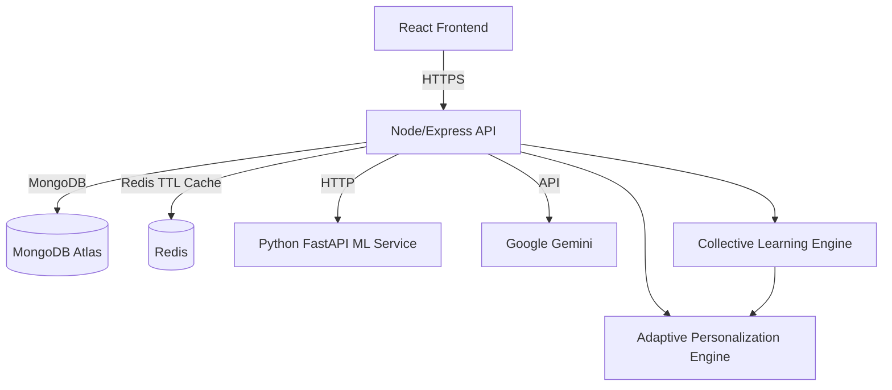

# MindEase Documentation

MindEase is a production-style mental wellness platform with three implemented intelligence layers:

1. User understanding and adaptive onboarding
2. Runtime personalization and emotional adaptation
3. Privacy-safe collective learning and recommendation evolution

The stack is a monolithic full-stack system with:

- `frontend/` React + Vite + TailwindCSS client
- `server/` Node.js + Express + MongoDB + Redis API and intelligence layer
- `ML/` Python FastAPI helper service for lightweight sentiment support

## Architecture



## Core Product Modules

### Task 1: User Understanding Foundation

Purpose:
- Adaptive onboarding
- Trait extraction
- User profiling

Implemented with:
- `OnboardingQuestion`
- `OnboardingResponse`
- `UserTrait`
- adaptive question selection and trait effect application

Main backend services:
- [adaptiveQuestion.service.js](</e:/FULL STACK/sem7/Final year Project/app/server/src/services/adaptiveQuestion.service.js>)
- [traitEngine.service.js](</e:/FULL STACK/sem7/Final year Project/app/server/src/services/traitEngine.service.js>)
- [onboarding.service.js](</e:/FULL STACK/sem7/Final year Project/app/server/src/services/onboarding.service.js>)

### Task 2: Adaptive Personalization System

Purpose:
- Mood logging
- Deterministic recommendations
- Pattern detection
- Forecasting
- Context-aware chatbot support

Implemented with:
- `MoodLog`
- `Recommendation`
- `RecommendationEffectiveness`
- `UserPattern`
- `UserInsight`
- Redis runtime memory

Main backend services:
- [recommendationEngine.service.js](</e:/FULL STACK/sem7/Final year Project/app/server/src/services/recommendationEngine.service.js>)
- [patternDetection.service.js](</e:/FULL STACK/sem7/Final year Project/app/server/src/services/patternDetection.service.js>)
- [forecasting.service.js](</e:/FULL STACK/sem7/Final year Project/app/server/src/services/forecasting.service.js>)
- [chatContext.service.js](</e:/FULL STACK/sem7/Final year Project/app/server/src/services/chatContext.service.js>)
- [ai.service.js](</e:/FULL STACK/sem7/Final year Project/app/server/src/services/ai.service.js>)

### Task 3: Collective Learning & Evolution

Purpose:
- Learn from anonymized outcomes across users
- Improve recommendation ranking globally
- Improve chatbot tone strategy indirectly
- Aggregate emotional-behavioral correlations

Implemented with:
- `CollectiveInsight`
- `PersonalityCluster`
- `RecommendationGlobalWeight`
- `EmotionalTrendAnalytics`

Main backend services:
- [collectiveAggregation.service.js](</e:/FULL STACK/sem7/Final year Project/app/server/src/services/collectiveAggregation.service.js>)
- [collectiveLearning.service.js](</e:/FULL STACK/sem7/Final year Project/app/server/src/services/collectiveLearning.service.js>)
- [clustering.service.js](</e:/FULL STACK/sem7/Final year Project/app/server/src/services/clustering.service.js>)
- [recommendationOptimization.service.js](</e:/FULL STACK/sem7/Final year Project/app/server/src/services/recommendationOptimization.service.js>)
- [collectiveJobs.service.js](</e:/FULL STACK/sem7/Final year Project/app/server/src/services/collectiveJobs.service.js>)

## Repository Structure

```text
app/
├── frontend/
│   ├── src/
│   │   ├── components/
│   │   ├── contexts/
│   │   ├── features/
│   │   │   ├── adaptive/
│   │   │   └── onboarding/
│   │   ├── lib/
│   │   ├── pages/
│   │   └── store/
├── server/
│   ├── src/
│   │   ├── config/
│   │   ├── controllers/
│   │   ├── data/
│   │   ├── middlewares/
│   │   ├── models/
│   │   ├── routes/
│   │   ├── scripts/
│   │   ├── services/
│   │   └── utils/
├── ML/
└── DOCUMENTATION.md
```

## Backend Overview

### Framework and Standards

- Node.js with ES modules only
- Express 5
- MongoDB via Mongoose
- Redis for runtime cache and job locking
- Joi validation
- centralized error handling
- `asyncHandler` for async route wrapping

### Key Middleware

- [auth.middleware.js](</e:/FULL STACK/sem7/Final year Project/app/server/src/middlewares/auth.middleware.js>)
- [validation.middleware.js](</e:/FULL STACK/sem7/Final year Project/app/server/src/middlewares/validation.middleware.js>)
- [role.middleware.js](</e:/FULL STACK/sem7/Final year Project/app/server/src/middlewares/role.middleware.js>)
- [rateLimit.middleware.js](</e:/FULL STACK/sem7/Final year Project/app/server/src/middlewares/rateLimit.middleware.js>)
- [error.middleware.js](</e:/FULL STACK/sem7/Final year Project/app/server/src/middlewares/error.middleware.js>)

### MongoDB Models

User and onboarding:
- `User`
- `UserTrait`
- `OnboardingQuestion`
- `OnboardingResponse`

Mood and adaptive runtime:
- `MoodLog`
- `Recommendation`
- `RecommendationEffectiveness`
- `UserPattern`
- `UserInsight`
- `Conversation`
- `Resource`

Collective learning:
- `CollectiveInsight`
- `PersonalityCluster`
- `RecommendationGlobalWeight`
- `EmotionalTrendAnalytics`

### Redis Usage

Redis is temporary only.

Current uses:
- active chat context
- recent emotional state
- recommendation cache
- collective aggregation cache
- collective summary cache
- recommendation global weight cache
- cron job locks

Main implementation:
- [redis.service.js](</e:/FULL STACK/sem7/Final year Project/app/server/src/services/redis.service.js>)

### Recommendation System

Recommendation selection is deterministic-first.

Inputs:
- user traits
- recent mood logs
- user-specific effectiveness history
- detected patterns
- forecast output
- time-of-day context
- collective global recommendation modifiers

Dataset:
- [recommendationDataset.js](</e:/FULL STACK/sem7/Final year Project/app/server/src/data/recommendationDataset.js>)

Gemini is not used to decide activities. Gemini is used only to:
- personalize phrasing of already selected recommendations
- generate chatbot replies from structured context

### Pattern Detection

Implemented patterns include:
- monday stress
- sleep-related mood decline
- social isolation pattern
- night anxiety
- recommendation effectiveness trends

### Forecasting

Forecasting is lightweight and deterministic:
- weighted average of recent moods
- recent trend adjustment
- sleep and stress adjustment
- pattern-based adjustment

### Collective Learning

Collective learning processes anonymized metadata only.

It does not retain:
- user identities
- emails
- raw private chat content
- direct personal memory across users

It does retain:
- cluster-level intervention success
- pattern-level trend summaries
- global activity weights
- tone strategy metadata

### Scheduled Jobs

Implemented with `node-cron`.

Jobs:
- nightly collective analysis
- cluster recalculation
- recommendation optimization refresh
- emotional trend aggregation

Entry point:
- [server.js](</e:/FULL STACK/sem7/Final year Project/app/server/src/server.js>)

## API Surface

Mounted route groups:

- `/api/auth`
- `/api/user`
- `/api/mood`
- `/api/recommendations`
- `/api/chat`
- `/api/resources`
- `/api/insights`
- `/api/patterns`
- `/api/onboarding`

Detailed reference:
- [API_ENDPOINTS_REFERENCE.md](</e:/FULL STACK/sem7/Final year Project/app/server/API_ENDPOINTS_REFERENCE.md>)

## Frontend Overview

### Stack

- React 18
- Vite
- TailwindCSS
- Redux Toolkit
- React Router
- React Query
- Framer Motion
- Recharts

### State

Auth:
- `AuthContext`

Theme:
- `ThemeContext`

Redux slices:
- onboarding slice
- adaptive slice

Adaptive frontend state includes:
- current emotional state
- recommendations
- recommendation history
- patterns
- forecast
- chatbot context
- collective summary cards

### Main Pages

- `Login`
- `Signup`
- `Dashboard`
- `MoodTracker`
- `MoodAnalytics`
- `Recommendations`
- `Chat`
- `Resources`
- `Profile`
- onboarding flow pages

### Frontend Intelligence Surfaces

Task 2 surfaces:
- adaptive dashboard cards
- recommendation cards with feedback actions
- chatbot context-based conversation
- emotional insights charts and pattern cards

Task 3 surfaces:
- collective insight cards
- behavioral trend summaries
- recommendation evolution indicators

These are privacy-safe summaries only.

## ML Service Overview

The `ML/` service remains a lightweight auxiliary service.

It is not the primary recommendation engine.

Current role:
- lightweight text sentiment support

Primary code:
- [main.py](</e:/FULL STACK/sem7/Final year Project/app/ML/app/main.py>)
- [ml_service.py](</e:/FULL STACK/sem7/Final year Project/app/ML/app/services/ml_service.py>)

## Environment Variables

### Backend

Important backend variables used by the codebase:

- `PORT`
- `NODE_ENV`
- `MONGO_URI`
- `JWT_SECRET`
- `JWT_EXPIRES_IN`
- `CLIENT_URL` or `CLIENT_URLS`
- `REDIS_URL`
- `ML_SERVER_URL`
- `RECOMMENDATIONS_API_KEY`
- `GMAIL_ID`
- `GMAIL_PASSWORD`
- `ADAPTIVE_QUESTION_COUNT`
- `ONBOARDING_VERSION`
- `CHAT_RATE_LIMIT_WINDOW_SECONDS`
- `CHAT_RATE_LIMIT_MAX`
- `DISABLE_COLLECTIVE_JOBS`

Note:
- The code expects `RECOMMENDATIONS_API_KEY` for Gemini-backed personalization and chat generation.

### Frontend

- `VITE_API_URL`

## Demo and Seed Utilities

Current utility scripts include:

- [seed.js](</e:/FULL STACK/sem7/Final year Project/app/server/src/seed.js>)
- [createRajDemoUser.js](</e:/FULL STACK/sem7/Final year Project/app/server/src/scripts/createRajDemoUser.js>)

`createRajDemoUser.js` creates a demo user with:
- onboarding completed
- 60 days of usage history
- varied mood logs
- completed recommendations
- resources

## Security Notes

- JWT-protected routes for private features
- role checks for admin operations
- Joi validation on write endpoints
- note sanitization before persistence
- chat rate limiting
- centralized error responses
- collective learning uses abstract behavioral metadata only

## Deployment

### Local Development

Backend:
```bash
cd server
npm install
npm run dev
```

Frontend:
```bash
cd frontend
npm install
npm run dev
```

ML service:
```bash
cd ML
pip install -r requirements.txt
uvicorn app.main:app --reload --port 8000
```

### Docker

Docker support exists via:
- [docker-compose.yml](</e:/FULL STACK/sem7/Final year Project/app/docker-compose.yml>)
- frontend Dockerfile
- server Dockerfile
- ML Dockerfile

## Verification Status

Recently verified in this codebase:
- backend module imports
- collective services imports
- frontend production build

Runtime items still dependent on environment:
- live MongoDB
- live Redis
- Gemini API access
- ML service availability

## Documentation Map

Use these files together:

- [DOCUMENTATION.md](</e:/FULL STACK/sem7/Final year Project/app/DOCUMENTATION.md>) for system overview
- [API_ENDPOINTS_REFERENCE.md](</e:/FULL STACK/sem7/Final year Project/app/server/API_ENDPOINTS_REFERENCE.md>) for backend routes
- [frontend/README.md](</e:/FULL STACK/sem7/Final year Project/app/frontend/README.md>) for frontend overview
- [frontend/FRONTEND_SETUP.md](</e:/FULL STACK/sem7/Final year Project/app/frontend/FRONTEND_SETUP.md>) for frontend setup
