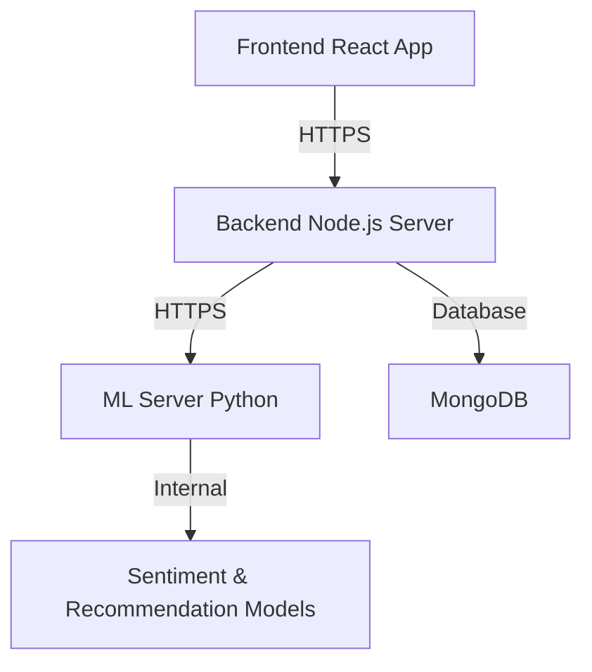

# MindEase - Full Project Documentation

MindEase is a mental wellness platform designed to help users track their mood, receive personalized recommendations for wellness activities, and converse with an AI chatbot for mental health support.

---

## 🏗️ System Architecture

The application is built using a microservices-inspired monolithic architecture with separate backend servers for application logic and Machine Learning tasks.



### Tech Stack
*   **Frontend**: React (Vite), Tailwind CSS, React Charts/Recharts (for Mood Analytics).
*   **Backend Application Server**: Node.js, Express, Mongoose (MongoDB ODM), JWT for authentication.
*   **Machine Learning Server**: Python, FastAPI, Sentiment Analysis Model, Recommendation Service.
*   **Database**: MongoDB.

---

## 🛠️ Backend Services (`server`)

The backend server manages user profiles, logs mood entries, serves resources, and integrates with the ML server to provide predictions and personalized suggestions.

### Directory Structure
```text
server/
├── src/
│   ├── config/          # DB connection, Environment variables
│   ├── controllers/     # Route handlers (auth, chat, mood, recommendations, resources)
│   ├── middlewares/     # Auth checks, error handling
│   ├── models/          # MongoDB Mongoose schemas
│   ├── routes/          # Express route definitions
│   ├── services/       # Logic for AI, Recommendation trigger, JWT, Password hashing
│   └── app.js           # Express app setup
└── API_ENDPOINTS_REFERENCE.md # Detailed API Documentation
```

### Core Data Models
*   **User**: `firstName`, `lastName`, `email`, `password` (hashed), `role`, `preferences` (wellness activities toggle).
*   **MoodLog**: `userId`, `date`, `moodScore` (1-10), `emotionTag`, `notes`, `activityDone`.
*   **Recommendation**: `userId`, `moodLogId`, `suggestedActivities`, `status` (`pending`, `accepted`).
*   **Resource**: `title`, `category` (articles, meditation, journaling, etc.), `contentURL`, `description`.
*   **Conversation**: `userId`, `messages` (array of `sender` and `text` for bot/user chat).

---

## 🖥️ Frontend Interface (`frontend`)

The frontend is a responsive React application built with Vite and styled using Tailwind CSS. It features dynamic analytics and interactive components.

### Pages & Navigation
1.  **Dashboard**: Overview of user's today status, latest mood, Quick links.
2.  **Mood Tracker**: Log daily mood entries along with notes and activity done status.
3.  **Mood Analytics**: Visual charts (weekly/daily trends, emotion distribution).
4.  **Recommendations**: Displays personalized tips or list of recommended activities based on latest logs.
5.  **Chat**: Interface to interact with an AI model for mental support.
6.  **Resources**: Educational resources and guides for mental health grouped by categories.
7.  **Profile**: Manage setup details, preferences, and account updates.

### State Management & Contexts
*   **AuthContext**: Manages login/logout states, stores auth token, fetches profile details.
*   **ThemeContext**: Light/Dark theme toggling for premium visuals.

---

## 🧠 Machine Learning Module (`ML`)

The ML module is powered by a FastAPI Python server that delivers intelligence to the application through sentiment analysis and recommendation matching.

### Endpoints
*   `POST /predict`: Evaluates input text and computes a sentiment score (`moodScore`) paired with sentiment classification.
*   `POST /recommend`: Suggests target wellness activities (e.g., `breathing`, `meditation`, `music`) tailored to response tag and previous score weightings.

### Model Mechanics
*   Uses trained templates for processing NLP inputs to compute daily vibe scores correctly from notes.
*   Maps score output triggers to preset response buffers to select ideal interventions.

---

## 💡 Key Features of MindEase

| Feature | Description |
| :--- | :--- |
| **Mood Log Tracking** | Log mood scores, attachment tag descriptions, and brief notes to keep a historic timeline of mental health vibes. |
| **Intelligent Analytics** | Process periodic aggregations of moods displaying trends of items over periodic thresholds. |
| **Personalized Suggestions** | Automated dispatch pipeline trigger to create continuous suggestions that support relevant moods following trigger outputs. |
| **Mental Support AI Bot** | Safe interactable text area built utilizing Gemini logic to dispatch real-time text interventions for calm queries. |
| **Content Library Dashboard** | Central source mapping educational interventions filtered by tags for fast-reading calming. |

---

## 🚀 Setup & Installation

For detailed instructions, refer to the respective module directories:

### Backend (`server`)
1. `cd server`
2. `npm install`
3. Configure `.env` with `MONGO_URI`, `JWT_SECRET`, etc.
4. `npm run dev` or `npm start`

### Frontend (`frontend`)
1. `cd frontend`
2. `npm install`
3. `npm run dev`
4. Refer to `FRONTEND_SETUP.md` for visual guides.

### Machine Learning (`ML`)
1. `cd ML`
2. Create and activate a Python virtual environment.
3. `pip install -r requirements.txt`
4. Run scripts or model deployment tasks.
